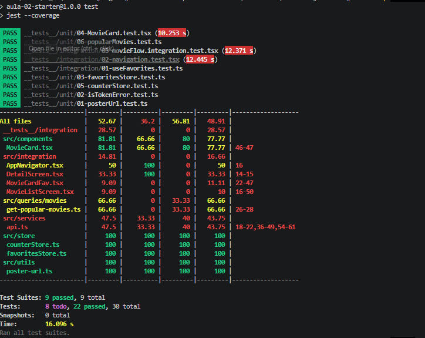

# README — Atividade 2 Suíte Unitária RN

## Identificação

* **Aluno:** Rodolfo Cassimiro
* **Node:** v22.x
* **Repo (seu fork):** https://github.com/lcrodolfo/puc-iec-testes-aplicacoes-mobile/tree/main/exercicios/02-suite-jest-rntl
* **Commit/PR de entrega:** https://github.com/jacksonsmith/puc-iec-testes-aplicacoes-mobile/pull/41

---

## Como rodar

```bash
cd exercicios/02-suite-jest-rntl/pratica
npm install
npm test
npm run test:coverage
```

---

## Resultado da suíte

```text
Test Suites: 9 passed, 9 total
Tests:       22 passed, 22 total
Todo:        8
Snapshots:   0 total
Time:        16.096 s
```

---

## Cobertura

| Pasta       | % Stmts | % Branch |
| ----------- | ------: | -------: |
| `src/store` |    100% |     100% |
| `src/utils` |    100% |     100% |

> Cobertura geral:

* Statements: **52.67%**
* Branches: **36.20%**
* Functions: **56.81%**
* Lines: **48.91%**

> 

---

## Testes escritos

| Arquivo                     | Casos | O que cobre                                                                                              |
| --------------------------- | ----: | -------------------------------------------------------------------------------------------------------- |
| `01-posterUrl.test.ts`      |     3 | Geração correta da URL do pôster para diferentes entradas.                                               |
| `02-isTokenError.test.ts`   |     5 | Identificação de erros de autenticação (401), ausência de token e demais cenários de erro.               |
| `03-favoritesStore.test.ts` |     6 | Adição, remoção, prevenção de duplicados, toggle, consulta e limpeza da lista de favoritos.              |
| `04-MovieCard.test.tsx`     |     2 | Renderização das informações do filme e interação do usuário utilizando React Native Testing Library.    |
| `05-counterStore.test.ts`   |     3 | Incremento, decremento e reset do contador.                                                              |
| `06-popularMovies.test.ts`  |     3 | Mock da API para validação da consulta de filmes populares.                                              |
| `Integração`                |     8 | Fluxo completo da aplicação, navegação entre telas, favoritos e funcionamento integrado dos componentes. |

---

## Decisões de teste

* O estado das stores foi reiniciado antes de cada teste utilizando `beforeEach`, garantindo independência entre os casos de teste.
* Foram criados testes para validar tanto cenários positivos quanto negativos, incluindo remoção de favoritos, prevenção de duplicatas e tratamento de erros de autenticação.
* Para os testes de integração foi utilizada a React Native Testing Library para simular o comportamento real do usuário durante a navegação.
* Nos testes da camada de consulta (`popularMovies`) foi utilizado `jest.mock` para isolar chamadas externas e tornar a suíte determinística.
* Foi utilizada IA como apoio para esclarecer dúvidas de sintaxe do Jest e revisar a documentação, realizando posteriormente ajustes manuais nos testes para refletir corretamente os requisitos da atividade.

---

## Referência

* Jest Documentation – Getting Started. Disponível em: https://jestjs.io/docs/getting-started

---

## 🎁 Bônus implementado

* [x] `popularMovies.test.ts` utilizando `jest.mock`.
* [ ] CI GitHub Actions configurado.
* [ ] Testes parametrizados (`it.each`).

### Evidências

## Evidências

### Arquivos de teste implementados

```text
__tests__/unit/
├── 01-posterUrl.test.ts
├── 02-isTokenError.test.ts
├── 03-favoritesStore.test.ts
├── 04-MovieCard.test.tsx
├── 05-counterStore.test.ts
└── 06-popularMovies.test.ts

__tests__/integration/
├── 01-useFavorites.test.ts
├── 02-navigation.test.tsx
└── 03-movieFlow.integration.test.tsx
```

### Resultado da execução

* ✅ 9 suítes de teste aprovadas.
* ✅ 22 testes executados com sucesso.
* ✅ Cobertura gerada com `npm run test:coverage`.

### Cobertura


### Repositório

* Repositório: https://github.com/lcrodolfo/puc-iec-testes-aplicacoes-mobile/tree/main/exercicios/02-suite-jest-rntl
